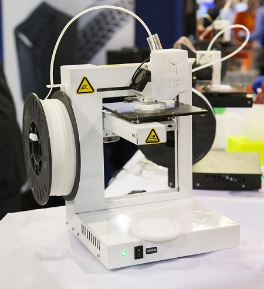

3d printing has seen quite a lot of hype over the last couple of years. Chris Anderson wrote about it in his book, [Makers: The New Industrial Revolution](http://amzn.com/0307720969), Staples started selling their first [3D printers](http://www.staples.com/3D-Printers/cat_CL211598) to consumers, and [Autodesk](http://www.autodesk.com/campaigns/spark) is building their own line of printers.

<!-- div style="background-color:#fff;display:inline-block;font-family:'Helvetica Neue',Arial,sans-serif;color:#a7a7a7;font-size:11px;width:100%;max-width:442px;float: right">
<iframe src="//embed.gettyimages.com/embed/456918681?et=7cW3p3MIRmNh8ZB8Gfh6rA&sig=hePR1RmwjdQI5jU8JE_SBFJv3vmIBriDKydXOXDs2cE=" width="442" height="388" scrolling="no" frameborder="0" style="display:inline-block;position:absolute;top:0;left:0;width:100%;height:100%;"></iframe>

<a href="http://www.gettyimages.com/detail/456918681" target="_blank" style="color:#a7a7a7;text-decoration:none;font-weight:normal !important;border:none;display:inline-block;">#456918681</a> / <a href="http://www.gettyimages.com" target="_blank" style="color:#a7a7a7;text-decoration:none;font-weight:normal !important;border:none;display:inline-block;">gettyimages.com</a>

Simultaneously, Microsoft released Windows 8 with support for 3D printers as first class devices. The 3D printer pipeline is similar to the one developed for 2D printers back when we were still dealing with paper jams in those dot matrix, continuous feed printers.

If you want to learn more about the new 3D printing pipeline in windows check out [this article](http://blogs.windows.com/bloggingwindows/2013/08/22/3d-printing-support-in-windows-8-1-explained/) by @GavinGear. He does an excellent job explaining the design goals of the Windows team that introduced this new capability.

If you want to add 3D printing capabilities to your app, you first need to understand the 3MF format. This is similar to the traditional STL format but adds printing specific information like part color to the data stream. The full spec is included in the [3D Printer SDK](http://msdn.microsoft.com/en-us/windows/hardware/bg183398). The easiest way to learn about a 3MF file is to use 3D builder to save a 3MF file, change the file extension to .zip and open it up. The 3d model for a very basic 10mm cube extracted from a 3MF format looks like this:

    <?xml version="1.0" encoding="UTF-8"?>
    <model unit="millimeter" xmlns="http://schemas.microsoft.com/3dmanufacturing/2013/01">
      <resources>
        <object id="0" type="model">
        <mesh>
          <vertices>
            <vertex x="0.000000" y="0.000000" z="10.000000" />
            <vertex x="0.000000" y="10.000000" z="10.000000" />
            <vertex x="0.000000" y="0.000000" z="0.000000" />
            <vertex x="0.000000" y="10.000000" z="0.000000" />
            <vertex x="10.000000" y="0.000000" z="10.000000" />
            <vertex x="10.000000" y="10.000000" z="10.000000" />
            <vertex x="10.000000" y="0.000000" z="0.000000" />
            <vertex x="10.000000" y="10.000000" z="0.000000" />
          </vertices>
          <triangles>
            <triangle v1="0" v2="1" v3="2" />
            <triangle v1="2" v2="1" v3="3" />
            <triangle v1="0" v2="4" v3="5" />
            <triangle v1="1" v2="0" v3="5" />
            <triangle v1="2" v2="6" v3="4" />
            <triangle v1="0" v2="2" v3="4" />
            <triangle v1="3" v2="7" v3="2" />
            <triangle v1="2" v2="7" v3="6" />
            <triangle v1="1" v2="5" v3="3" />
            <triangle v1="3" v2="5" v3="7" />
            <triangle v1="6" v2="7" v3="5" />
            <triangle v1="4" v2="6" v3="5" />
          </triangles>
        </mesh>
      </object>
    </resources>
    <build>
      <item objectid="0" />
    </build>
    </model>

You can certainly build a 3mf file yourself using the aforementioned reference doc but if you are writing a C++ app, check out the [Sample 3D App](http://code.msdn.microsoft.com/windowsapps/3D-Printing-Sample-b5b75c86) at <http:/dev.windows.com> which includes the code to write that model out to an in-memory stream and publish it to the printing pipeline.

While working on some recent apps, I've found a few tips to keep in mind when writing new apps that publish 3D data:

1. Z Axis data should always be positive. Device Drivers will not extrapolate a floor based on your geometry. You need to make sure all Z values are positive.
2. Some printers will only accept dimensions in millimeters and will not give you very good error information to help debug this.
3. 3D printing is the like wild west right now. There is still a lot of variability what data will be accepted from printers. If you have trouble, start the printer's native application and attempt printing your model directly to get more details about the model issues.
4. Like much open source software, documentation and error code information is still minimal. Use the 3D printing forums for your device to troubleshoot.

If you have questions, check out these the [3D Printing QuickStart](http://msdn.microsoft.com/en-us/library/windows/apps/xaml/dn263132.aspx) or  [Send a mail to Ask 3D Printing @ Microsoft](mailto:ask3dprinting@microsoft.com).

## Resources

[Download the SDK for 3MF spec](http://msdn.microsoft.com/en-us/windows/hardware/bg183398)

[3D Builder App](http://apps.microsoft.com/windows/en-us/app/3d-builder/75f3f766-13b3-45e9-a62f-29590d5781f2)

[Sample App](http://code.msdn.microsoft.com/windowsapps/3D-Printing-Sample-b5b75c86)

[3D Printing QuickStart](http://msdn.microsoft.com/en-us/library/windows/apps/xaml/dn263132.aspx)

[Send a mail to Ask 3D Printing @ Microsoft](mailto:ask3dprinting@microsoft.com)
